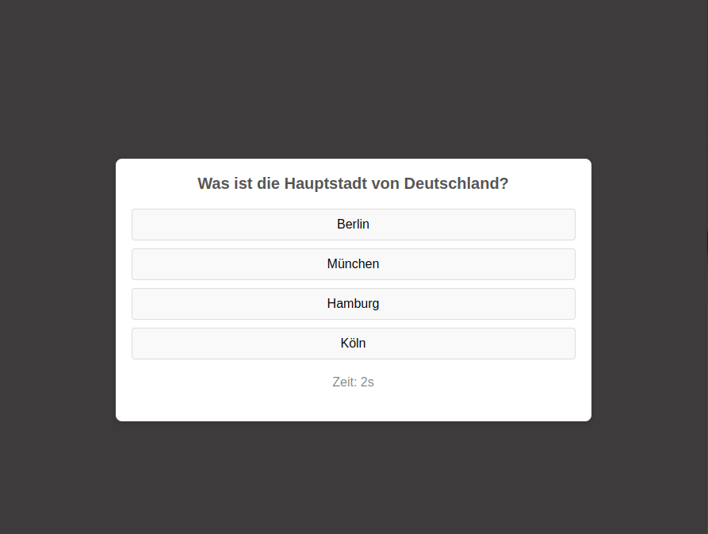

--- markdown
# Quiz-Spiel

Ein einfaches Quiz-Spiel mit JavaScript, HTML und CSS. Dieses Projekt ermöglicht es dem Benutzer, eine Reihe von Quizfragen zu beantworten und am Ende das Ergebnis sowie die Anzahl der richtigen und falschen Antworten zu sehen.

## Online-Demo

Das Quiz-Spiel kann über folgenden Link direkt ausprobiert werden:
[Quiz-Spiel auf GitHub Pages](https://orhanguezel.github.io/simple-quiz-game/)

## Projektübersicht

Das Quiz-Spiel besteht aus einer Reihe von Fragen, die dem Benutzer nacheinander präsentiert werden. Für jede Frage gibt es mehrere Antwortoptionen, und der Benutzer muss die richtige Antwort auswählen. Der Benutzer hat pro Frage eine begrenzte Zeit (60 Sekunden), um eine Antwort auszuwählen. Am Ende des Quiz wird die Gesamtpunktzahl sowie die Anzahl der richtigen und falschen Antworten angezeigt.

## Demo



*Das Bild oben zeigt die Benutzeroberfläche des Quiz-Spiels.*

## Funktionen

- **Mehrere Fragen**: Das Quiz umfasst mehrere Fragen, die in einer festgelegten Reihenfolge angezeigt werden.
- **Antwortauswahl**: Der Benutzer kann eine Antwortoption auswählen, indem er auf die entsprechende Schaltfläche klickt.
- **Zeitlimit**: Der Benutzer hat 60 Sekunden Zeit, um jede Frage zu beantworten. Wenn die Zeit abläuft, wird die Antwort als falsch gewertet.
- **Punktesystem**: Jede richtige Antwort bringt 20 Punkte.
- **Ergebnisanzeige**: Am Ende des Quiz wird die Gesamtpunktzahl sowie die Anzahl der richtigen und falschen Antworten angezeigt.
- **Neustart-Funktion**: Der Benutzer kann das Quiz jederzeit neu starten und von vorne beginnen.

## Installation

1. Klonen Sie dieses Repository:
   ```bash
   git clone https://github.com/Orhanguezel/simple-quiz-game.git
   ```
2. Wechseln Sie in das Projektverzeichnis:
   ```bash
   cd simple-quiz-spiel
   ```
3. Öffnen Sie die `index.html` Datei in Ihrem Browser, um das Spiel zu starten.

## Verwendung

1. Klicken Sie auf die Antwortoption, die Ihrer Meinung nach korrekt ist.
2. Wenn Sie die Frage beantwortet haben, wird automatisch die nächste Frage angezeigt.
3. Falls Sie eine Antwort nicht innerhalb des Zeitlimits (60 Sekunden) auswählen, wird die Frage als falsch gewertet.
4. Am Ende des Quiz wird Ihre Punktzahl sowie die Anzahl der richtigen und falschen Antworten angezeigt.
5. Klicken Sie auf die Schaltfläche „Neustart“, um das Quiz erneut zu spielen.

## Projektstruktur

- `index.html`: Die Hauptseite des Quiz-Spiels.
- `style.css`: Die CSS-Datei für das Styling der Benutzeroberfläche.
- `script.js`: Enthält die JavaScript-Logik für das Quiz-Spiel.
- `README.md`: Projektbeschreibung und Anweisungen.

## Klassenbeschreibung

### `BaseFrage`

Die `BaseFrage`-Klasse enthält die Grundinformationen einer Frage und eine Methode, um den Fragetext anzuzeigen.

### `Frage`

Die `Frage`-Klasse erbt von `BaseFrage` und fügt spezifische Funktionen für eine Multiple-Choice-Frage hinzu, einschließlich der Optionen und der Überprüfung der Antwort.

### `Quiz`

Die `Quiz`-Klasse verwaltet den gesamten Ablauf des Quiz, einschließlich der Frageauswahl, der Punkteberechnung und der Timer-Funktion.

## Beispiel für Fragen

Die Fragen werden als Instanzen der `Frage`-Klasse erstellt und im `Quiz`-Objekt verwendet:

```javascript
const fragen = [
    new Frage("Was ist die Hauptstadt von Deutschland?", ["Berlin", "München", "Hamburg", "Köln"], 0),
    new Frage("Welches ist die kleinste Primzahl?", ["0", "1", "2", "3"], 2),
    new Frage("Welcher Planet ist der Erde am nächsten?", ["Mars", "Venus", "Jupiter", "Saturn"], 1),
    new Frage("In welchem Jahr begann der Erste Weltkrieg?", ["1912", "1914", "1918", "1920"], 1),
    new Frage("Welche Farbe entsteht, wenn man Blau und Gelb mischt?", ["Grün", "Lila", "Braun", "Orange"], 0),
];
```

## Lizenz

Dieses Projekt ist unter der MIT-Lizenz lizenziert.

## Kontakt

Bei Fragen oder Anregungen können Sie sich gerne an mich wenden.
```